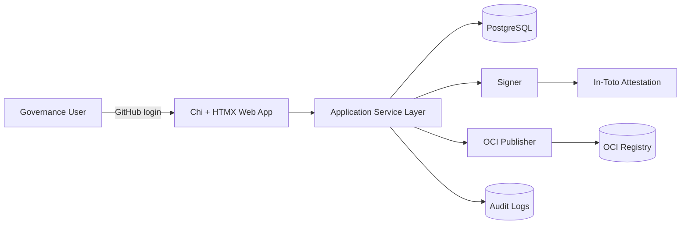

# Architecture Diagram

Layers:

1. `internal/web` - routes, handlers, templates
2. `internal/app` - workflow orchestration (human-selected outcomes only)
3. `internal/domain` - core entities and enums
4. `internal/infra` - Postgres store, signing, OCI abstraction
