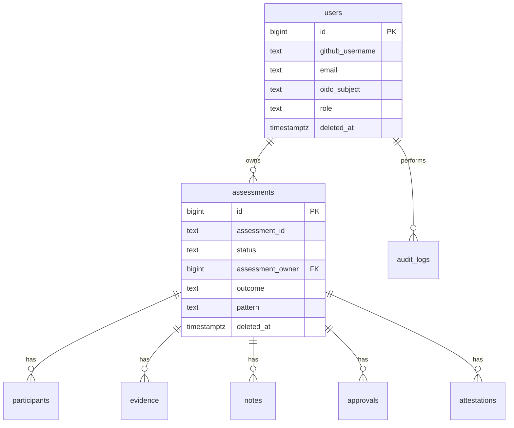

# Database ERD

```mermaid
erDiagram
  users ||--o{ assessments : owns
  assessments ||--o{ participants : has
  assessments ||--o{ evidence : has
  assessments ||--o{ notes : has
  assessments ||--o{ approvals : has
  assessments ||--o{ attestations : has
  users ||--o{ audit_logs : performs

  users {
    bigint id PK
    text github_username
    text email
    text oidc_subject
    text role
    timestamptz deleted_at
  }

  assessments {
    bigint id PK
    text assessment_id
    text status
    bigint assessment_owner FK
    text outcome
    text pattern
    timestamptz deleted_at
  }
```

All entities include `deleted_at` for soft-delete compatibility.
